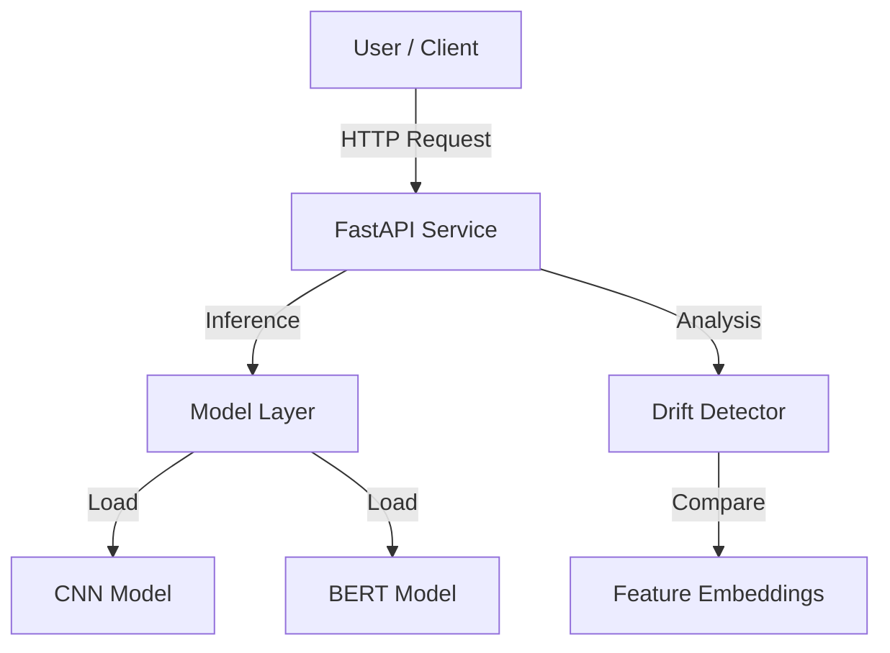

# System Architecture

The system is built as a modular microservice.

## High-Level Design

## Components

### API Layer
Handles incoming requests and routes them to the appropriate logic. It manages the lifecycle of the models and orchestrates the drift detection process.

### Model Layer
Abstracts the underlying ML frameworks (PyTorch, Transformers). It provides a consistent interface (`predict`, `get_embeddings`) for all models.

### Drift Detection Layer
Implements statistical tests to compare the distribution of feature embeddings from reference data (training set) and current data (production traffic).
